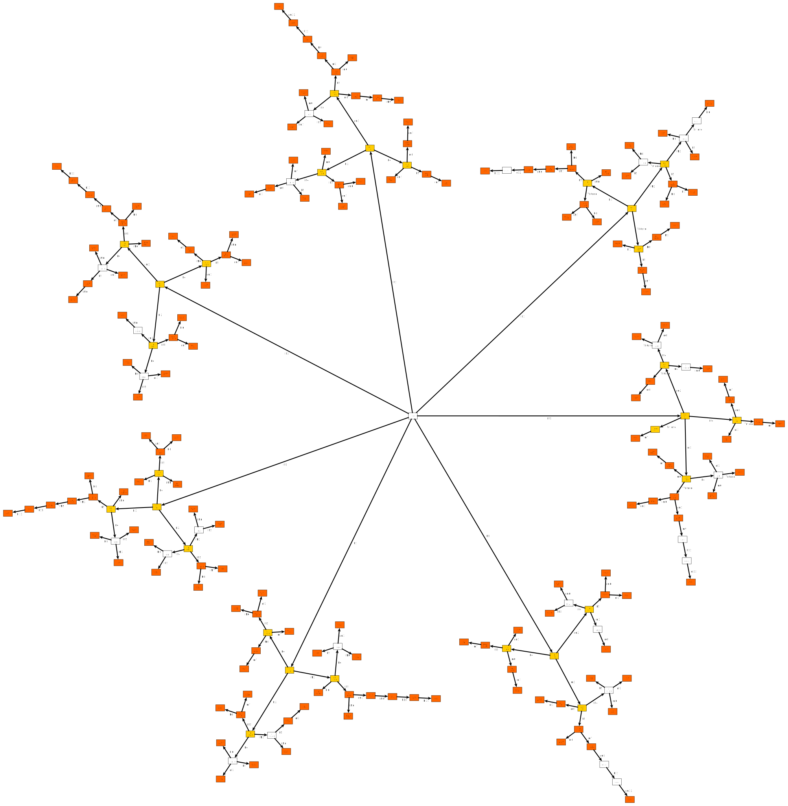
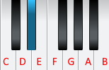
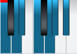
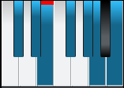
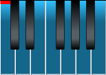
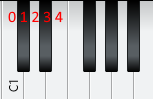
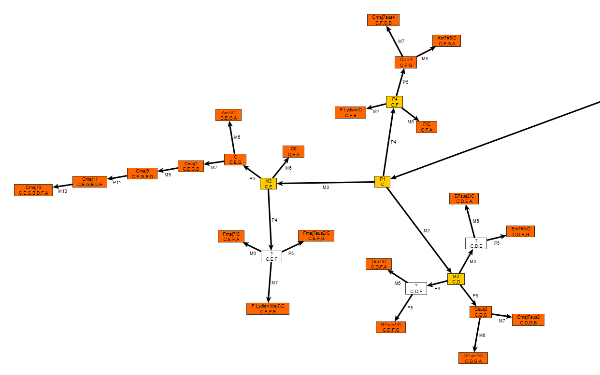

# Chord generator

## Introduction

Chord generator is able to generate all possible chords for a given musical scale. It can be used as the basis of a chord recognition system or any composition tool. The list of chords is saved as a GraphML file allowing some kind of visualization via [yEd](https://www.yworks.com/products/yed) editor.

Here is the chords of C Major scale (up to 7 notes):



Legend:

- Each node is an ordered set of notes. The center is an empty set. 
- Orange node is a valid chord with at least 3 notes
- Yellow node is not really a chord because it has less than 3 notes
- White node is not really a chord because it has no known name, notes are very dissonant
- Each edge correspond to a chosen interval that keep you inside the scale.

## Music Theory in Java

This will explain the fundamentals of music theory for newbies and how to model music theory in Java.

### Note names for newbies

Music theory is really weird when it comes to name notes. In case you don't know yet, let me show you:

You have 12 notes at your disposal. The 13th is named as the first one. As soon as you use a scale, you will restrict this amount to, let say, seven of them. There is something like 4 ways to name a single note, so hang on!

- White notes on the piano keyboard have a name with a letter in this order: C,D,E,F,G,A,B
- Black notes on the piano keyboard don't have a name(!) so you have to use a white note followed by an offset 

Here possible offsets you can use to name a note:

| Offset name | Offset value |
| :---------: | :----------: |
|      #      |      +1      |
|     ##      |      +2      |
|      b      |      -1      |
|     bb      |      -2      |

Here we want to name the second black note in the piano keyboard:



It can be named: D#, Eb, Fbb

Some rules

- It is prohibited to use # and b at the same time: D##b
- It is perfectly legal to name a white note using offsets: E can also be named D## or Fb
- When you list the allowed notes for a given scale, it is prohibited to mix # and b offsets. A F# scale can't use any **b** offsets to name notes.
- When you list the allowed notes for a given scale, it is prohibited to use two times the same note name. We call this **Diatonic names**. This rule is sometime responsible of the use of **##** and **bb** offsets (see the scale C Locrian bb7).

As an example, how to name the C Minor scale notes ?



- This is the right way given the rules: C D Eb F G Ab Bb
- This is wrong (because D and G is used two times): C D D# F G G# A#
- This is wrong (because we mix # and b, and because A is used two times): C D Eb F G Ab A#

The method `Scale::computeNoteNames()` implements those rules.

### Scale formula

A scale is a unordered set of notes which is generated from a formula. The formula is just a list of "jump" that you must do starting from the root note of the scale. There is various ways to name those jumps, here we recognize the following:

- "H" or "S": Semi tone or half step, **jump 1 piano note**
- "T" or "W": tone or whole step, **jump 2 piano notes**
- "WH" or "TS": Whole Half step or Tone and semi tone step, **jump 3 piano notes**

Example: The Major scale formula is T-T-S-T-T-T-S, here is what happen if we apply the formula on the root note E:



This is the E Major scale. The blue notes are the note in the scale, the black and white notes are forbidden.

Of course if you apply the formula on the root note C, you will get all the white notes of the piano:



This is the C Major scale. The piano layout match it exactly. black notes are out of the scale, white notes are in the scale.

In Java we will use two classes to model those concepts: 

- **ScaleFormula.java** takes care of parsing the formula and convert it in a list of steps
- **Scale.java** is an instance of a scale formula applied to a given root note.

Here how to create a C Major scale:

```java
Scale s = new Scale("C Major", 0, new ScaleFormula("T-T-S-T-T-T-S")); // 0 is the root note C
```

Here how to create a D# Major scale:

```java
Scale s = new Scale("C Major", 3, new ScaleFormula("T-T-S-T-T-T-S")); // 3 is the root note D#
```

### Octave, modulo 12 and note indexes

In music theory you have only 12 notes. The 13th note is considered as the same as the first one as we use a modulo 12. The range 1-12 is called an **Octave**.

If you receive a MIDI note (numbered from 0 to 127), you have to apply a **modulo 12** to get the note name. For instance 76 is the note E because 76 mod 12 = 4



By the way, it is very common to use C1 as "the note C in octave 1".

In this project we deal with various note indexes and offsets so you have to pay attention to them:

In **ScaleFormula.java** we store the formula as a list of offsets starting from 0. The Major scale becomes [0, 2, 4, 5, 7, 9, 11, 12]. We don't need to apply any modulo 12 at this point. It is important to note that those numbers are not note indexes. They are jump or steps in semi tones.

In **Scale.java** we apply the scale offsets to a given root note. **At this point we apply a modulo 12**. 

- C Major scale becomes [0, 2, 4, 5, 7, 9, 11], the root note is 0. This correspond to the notes [C,D,E,F,G,A,B]
- E Major scale becomes [4, 6, 8, 9, 11, 1, 3], the root note is 4. This correspond to the notes [E,F#,G#,A,B,C#,D#]

### Intervals

An interval is just two notes played together. We could say it is the most simple possible chord. There are 25 intervals. Each of them have a **name** and a **code**.

| Interval name | Code |Number of semitones|
| :-----------: | :--: | :--:|
|Unison| P1 |0|
|Minor Second| m2 |1|
|Major Second| M2 |2|
|Minor Third| m3 |3|
|Major Third| M3 |4|
|Perfect Fourth| P4 |5|
|Diminished Fifth (or Augmented fourth)| Tritone |6|
|Perfect Fifth| P5 |7|
|Minor Sixth| m6 |8|
|Major Sixth| M6 |9|
|Minor Seventh| m7 |10|
|Major Seventh| M7 |11|
|Perfect Octave| P8 |12|
|Minor Ninth| m9 |13|
|Major Ninth| M9 |14|
|Minor tenth| m10 |15|
|Major tenth| M10 |16|
|Perfect eleventh| P11 |17|
|Diminished twelfth (or Augmented eleventh)| d12 |18|
|Tritave| P12 |19|
|Minor thirteenth| m13 |20|
|Major Thirteenth| M13 |21|
|Minor fourteenth| m14 |22|
|Major Fourteenth| M14 |23|
|Perfect fifteenth (or Double Octave)|P15|24|

To generate chords, you must start from a root note then stack multiple intervals based on this root note.

Here is an example in C major scale:



For instance:

- A chord C major (C,E,G) is made of 2 intervals: M3 and P5
- A chord Cmaj7 (C,E,G,B) is made of 3 intervals: M3, P5 and M7
- A chord Cmaj7sus2 (C,D,G,B) is made of 3 intervals: M2, P5 and M7

The quality of each chord comes from the intervals. They will have more or less dissonances. 

As you can see in yEd, some paths are longer than others because they stay in the scale.

In our code the class **Intervals.java** will provides methods to get the name of any interval.

### Inverted chords

This is were things get complicated... The theory consider that the notes of chord can be inverted and it will be the same chord. This is really weird because the intervals won't be the same so the quality of what you ear won't be the same.

Here what happen for a C major chord:

- [C,E,G] is the root position, the bass is C, it is a regular C chord
- [E,G,C] is the first inversion, the bass is E, it is noted C/E
- [G,C,E] is the second inversion, the bass is G, it is noted C/G

Because of this, we had to make our model a little bit more complex:

- **ChordFormula.java** : store a list of intervals without any root note
- **Chord.java**: apply a chord formula to a given root note
- **InvertedChord.java**: Inherit from Chord and uses an inverted ChordFormula. Provide a link to the base chord.

Here what happen for a C major chord:

- [C,E,G] is a **Chord** with a **ChordFormula** [M3,P5] applied to C
- [E,G,C] is the first inversion, an **InvertedChord** with a **ChordFormula** [m3,m6] applied to E
- [G,C,E] is the second inversion, an **InvertedChord** with a **ChordFormula** [P4,M6] applied to G

### Naming chords

I tried to make my best on this. The code is in `Intervals::getChordType()`

There is no magic formula to output the name of a chord. You have to hard code some rules that's all. The main idea is to inspect the intervals in the chord and decide how to name it. Sometimes there is no name, so we output "?".

Here is the rules for 3 notes chords:

```java
			if (intervals[1].equals("M2") && intervals[2].equals("P5"))
				type = "sus2";
			else if (intervals[1].equals("P4") && intervals[2].equals("P5"))
				type = "sus4";
			else if (intervals[1].equals("Tritone") && intervals[2].equals("P5"))
				type = " Lydian";
			else if (intervals[1].equals("m2") && intervals[2].equals("P5"))
				type = " Phrygian";
			else if (intervals[1].equals("P4") && intervals[2].equals("Tritone"))
				type = " Locrian";
			else if (intervals[1].equals("M3") && intervals[2].equals("P5"))
				type = ""; // major
			else if (intervals[1].equals("m3") && intervals[2].equals("P5"))
				type = "m"; // minor
			else if (intervals[1].equals("m3") && intervals[2].equals("Tritone"))
				type = "°"; // diminished, both fifth and second are diminished
			else if (intervals[1].equals("M3") && intervals[2].equals("Tritone"))
				type += "(b5)"; // flat fifth only, the second is major
			else if (intervals[1].equals("M3") && intervals[2].equals("m6"))
				type = "+"; // or (#5)
			else if (intervals[1].equals("m3") && intervals[2].equals("m6"))
				type = "?";
			else if (intervals[1].equals("P4") && intervals[2].equals("m6"))
				type = "?";
			else if (intervals[1].equals("P4") && intervals[2].equals("M6"))
				type = "?";
			else if (intervals[1].equals("M3") && intervals[2].equals("M6"))
				type = "6";
			else if (intervals[1].equals("m3") && intervals[2].equals("M6"))
				type = "m6";
			else if (intervals[1].equals("P4") && intervals[2].equals("Tritone"))
				type = "sus4(b5)";			
			else
				type = "?";
```


# How to generate chords

## Basic principle

We do a depth first recursion. Each time we recurse, we add an interval to the root note.

During the recursion (to be precise when we return, after going in depth) we call `emitNode()` and `emitEdge()` to generate some GraphML.

A global counter `nodeCounter` is used to build a unique GraphML node identifier

## Why depth first recursion

Because you need to know if you have found chords before writing a new edge in the GraphML.

## Sanity check during recursion

When you had a new interval, you may jump outside the current octave to return to a note that you already use in the current chord. This is what `ChordFormula.isValid()` check. The list of note indexes must contain unique notes modulo 12.

If the chord have no name, it is certainly an inverted chord. So we try this during the recursion:

```java
chord = new Chord(cf, rootNote);
invertedChord = getInvertedChord(chord); // magic happen here
name = Intervals.getChordType(cf);
if (name.contains("?") && invertedChord!=null) {					
	chord = invertedChord;
	invertedChord = null;
	name = chord.getChordName();
}

```

`invertedChord` will be a "fixed" version of `chord`

This is why we are able to display **C/G** instead of ? when we generate an inverted C chord with bass G.

# Scale URL

Wait, what? A scale can have a URL? Indeed, if you use the work of **Ian Ring** you can represent a scale by a sequence of 12 bits. Each bit correspond to a note on the piano keyboard. 

This will give you a number that you can use on his website:

https://ianring.com/musictheory/scales/2741 is the URL of the major scale 101010110101

We build such URL in the constructor of **Scale.java**

# How to display your GraphML in yEd

If you import the file in yEd you will get this:


Then, select "Tools/Fit Node to Label"

Then, select "Layout/Circular"

This will display nicely your graph of chords

